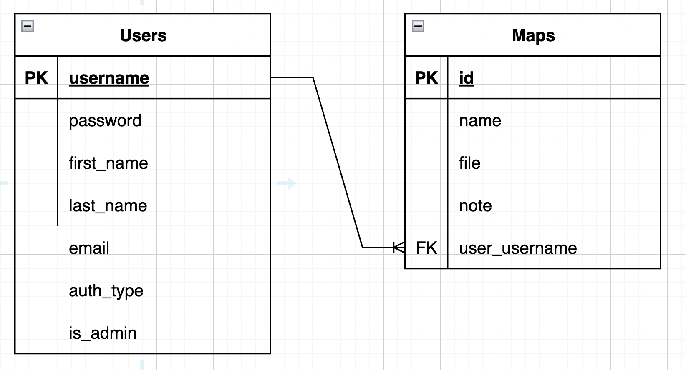

# Visu-NYC Documentation

Visu-NYC is a geospacial visualization application that allows users to see public data from NYC. This app embeds a map component called [kepler.gl](https://github.com/keplergl/kepler.gl) and has backend functionality to allow users to create accounts and save maps to their profiles.

\*The app currently only allows you to view maps of tree count by census tract (neighborhood) and restaurant inspections. More maps to be added!

### Database schema

## Data used

Data from NYC Open Data was processed and included as csvs to populate the kepler maps.

- [NYC 2010 Census tract data](https://data.cityofnewyork.us/City-Government/2010-Census-Tracts/fxpq-c8ku/data)
- [2015 Street Tree Census](https://data.cityofnewyork.us/Environment/2015-Street-Tree-Census-Tree-Data/uvpi-gqnh)
- [DOHMH New York City Restaurant Inspection Results](https://data.cityofnewyork.us/Health/DOHMH-New-York-City-Restaurant-Inspection-Results/43nn-pn8j)

## Deployment

Visu-nyc is deployed using [Render](https://render.com/) at [Visu-NYC](https://visu-nyc-frontend.onrender.com/).

## Features

- **Secure authentication:** Securely sign up or login with password encryption
- **NYC geospacial data pre-populated:** Data will be pre loaded into the kepler.gl map.
- **Adjust layers and filters on map:** adjust the layers and filters to control the data they see in the map.
- **Export maps:** export maps and data files locally
- **Save Maps to account:** Save maps and notes to account for later access. Maps created by all users can be viewed under all maps.

## Demo / User flow

- The home page of the app will display maps with NYC data pre populated. Login or signup is not required to use the maps, but encouraged if you want to save maps to your account or view maps others have created.
  
- You can interact with the maps, create layers with uploaded data, or filter for the data you want to see directly in the kepler.gl map.
  
- Save a map to your account using the add map form.
  
- View profile details and saved maps in your profile.
  

## Stack used

- React.js
- Node.js
- PostgreSQL
- Express.js

## Feedback

Reach out to jennytakahara@gmail.com with any questions or feedback!
